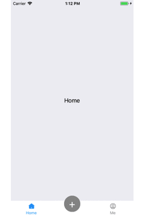
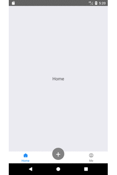

## react-native-tabbar

tabbar component for React Native

### Overview
tabbar using react-native,support android and ios,mobile bottom tab bar with more freedom.And what's more,solved the problem overflow parent hidden on the android,also it can be defined center item by itself.

### Installation

Make sure that you are in your React Native project directory and run

```javascript
npm install react-native-nav-tabbar --save
```
### Basic usage

```javascript
import TabBar from 'react-native-nav-tabbar';
<TabBar>
    <TabBar.Item
        icon={require('./image/start_normal.png')}
        selectedIcon={require('./image/start_hightlight.png')}
        title="Home"
    >
        <View style={styles.textContent}>
            <Text style={{fontSize: 18}}>Home</Text>
        </View>
    </TabBar.Item>
    <TabBar.Item>
        <View style={styles.textContent}>
            <Text style={{fontSize: 18}}>Friends</Text>
        </View>
    </TabBar.Item>
    <TabBar.Item
        icon={require('./image/start_normal.png')}
        selectedIcon={require('./image/start_hightlight.png')}
        title="Me"
    >
        <View style={styles.textContent}>
            <Text style={{fontSize: 18}}>Me</Text>
        </View>
  </TabBar.Item>
</TabBar>
```
### Component props

| prop | value | required/optional | description |
| --- | --- | --- | --- |
| icon | image source | required | the icon when item is not focus |
| selectedIcon | image source | required | the icon when item is focus |
| title | string | required | title of item |

### Examples



